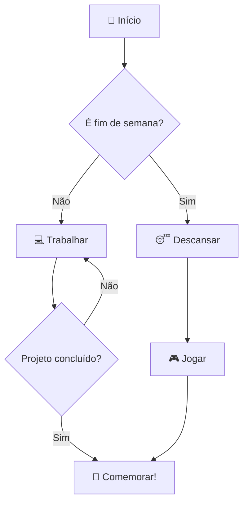
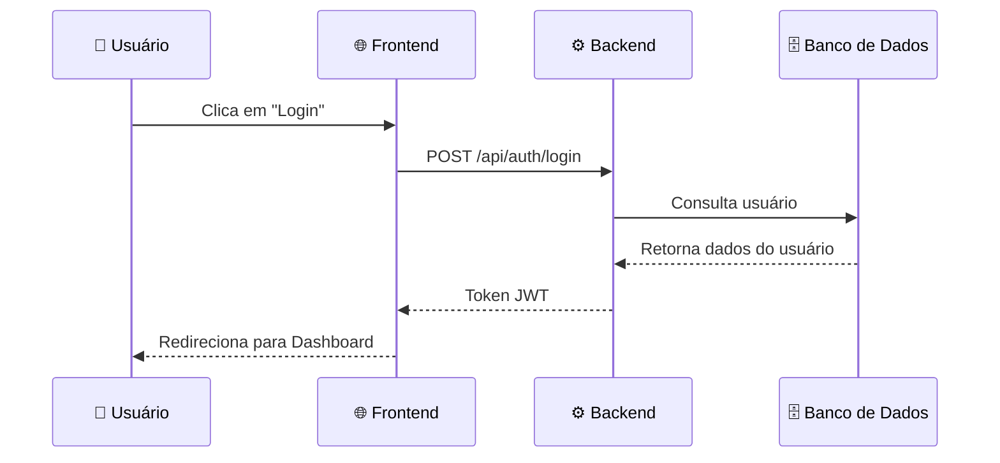
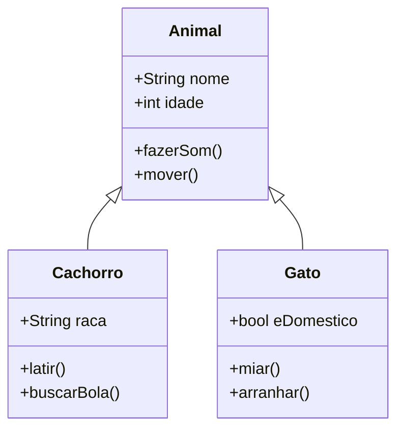
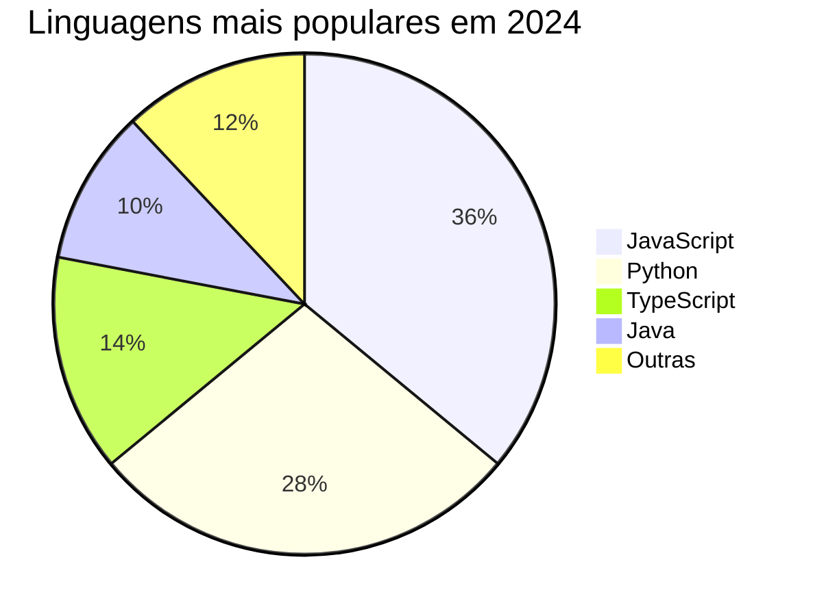
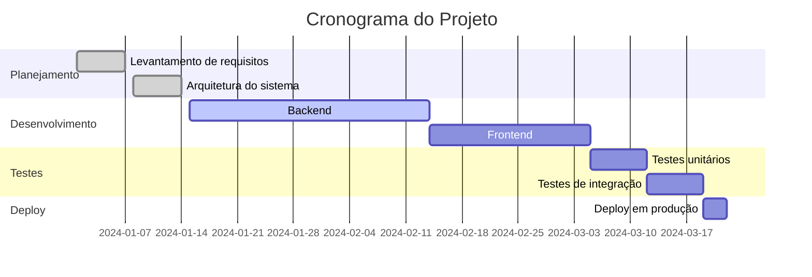

# 🎨 Demonstração de Funcionalidades do Markdown

> Uma página mostrando o que é possível fazer com Markdown!

---

## 📋 Índice

- [Títulos](#títulos)
- [Formatação de Texto](#formatação-de-texto)
- [Listas](#listas)
- [Links e Imagens](#links-e-imagens)
- [Tabelas](#tabelas)
- [Blocos de Código](#blocos-de-código)
- [Citações](#citações)
- [Alertas](#alertas)
- [Tarefas](#tarefas)
- [Emojis](#emojis)
- [Detalhes e Resumo](#detalhes-e-resumo)
- [Notas de Rodapé](#notas-de-rodapé)
- [Referências e Âncoras](#referências-e-âncoras)
- [Matemática](#matemática)
- [Diagramas Mermaid](#diagramas-mermaid)

---

## Títulos

# Título H1
## Título H2
### Título H3
#### Título H4
##### Título H5
###### Título H6

---

## Formatação de Texto

| Estilo | Sintaxe | Resultado |
|--------|---------|-----------|
| Negrito | `**texto**` | **texto** |
| Itálico | `*texto*` | *texto* |
| Negrito e Itálico | `***texto***` | ***texto*** |
| Tachado | `~~texto~~` | ~~texto~~ |
| Subscrito | `H~2~O` | H~2~O |
| Sobrescrito | `x^2^` | x^2^ |
| Código inline | `` `código` `` | `código` |

---

## Listas

### Lista não-ordenada

- Item principal
  - Sub-item
    - Sub-sub-item
- Outro item principal
- Mais um item

### Lista ordenada

1. Primeiro passo
2. Segundo passo
   1. Sub-passo 2.1
   2. Sub-passo 2.2
3. Terceiro passo

### Lista de definição

Markdown
: Uma linguagem de marcação leve para criação de texto formatado.

GitHub
: Uma plataforma de hospedagem de código que usa Git para controle de versão.

---

## Links e Imagens

### Links

- Link simples: [GitHub](https://github.com)
- Link com título: [GitHub](https://github.com "Visite o GitHub")
- Link de referência: [OpenAI][openai-ref]
- Link automático: <https://github.com>
- Link para seção: [Voltar ao índice](#-índice)

[openai-ref]: https://openai.com "Site da OpenAI"

### Imagens


Imagem com link clicável:

[](https://daringfireball.net/projects/markdown/)

---

## Tabelas

### Tabela básica

| Nome       | Linguagem  | Estrelas |
|------------|------------|----------|
| React      | JavaScript | ⭐⭐⭐⭐⭐   |
| Django     | Python     | ⭐⭐⭐⭐    |
| Rails      | Ruby       | ⭐⭐⭐⭐    |
| Spring     | Java       | ⭐⭐⭐     |

### Alinhamento nas tabelas

| Esquerda | Centro | Direita |
|:---------|:------:|--------:|
| Texto    | Texto  | Texto   |
| 1        | 2      | 3       |
| abc      | def    | ghi     |

---

## Blocos de Código

### Código inline

Use `console.log()` para depurar em JavaScript.

### Python

```python
def fibonacci(n: int) -> list[int]:
    """Retorna os primeiros n números de Fibonacci."""
    fib = [0, 1]
    for i in range(2, n):
        fib.append(fib[i-1] + fib[i-2])
    return fib[:n]

print(fibonacci(10))
# Output: [0, 1, 1, 2, 3, 5, 8, 13, 21, 34]
```

### JavaScript

```javascript
const fetchData = async (url) => {
  try {
    const response = await fetch(url);
    const data = await response.json();
    return data;
  } catch (error) {
    console.error('Erro ao buscar dados:', error);
  }
};
```

### Bash

```bash
#!/bin/bash
# Script de backup simples
SOURCE="/home/usuario/documentos"
DEST="/backup/$(date +%Y%m%d)"

mkdir -p "$DEST"
cp -r "$SOURCE" "$DEST"
echo "Backup concluído em $DEST"
```

### JSON

```json
{
  "nome": "Projeto Incrível",
  "versao": "1.0.0",
  "tecnologias": ["React", "Node.js", "PostgreSQL"],
  "configuracoes": {
    "porta": 3000,
    "debug": true
  }
}
```

### SQL

```sql
SELECT
  u.nome,
  COUNT(p.id) AS total_pedidos,
  SUM(p.valor) AS valor_total
FROM usuarios u
LEFT JOIN pedidos p ON u.id = p.usuario_id
WHERE u.ativo = TRUE
GROUP BY u.id, u.nome
ORDER BY valor_total DESC
LIMIT 10;
```

---

## Citações

> "A melhor maneira de prever o futuro é inventá-lo."
> — Alan Kay

> **Citação aninhada:**
>
> > "Dentro de uma citação, podemos ter outra citação ainda mais profunda."
> >
> > — Alguém muito sábio

---

## Alertas

> [!NOTE]
> Esta é uma nota informativa para o leitor.

> [!TIP]
> Dica: Você pode combinar vários recursos do Markdown para criar documentos ricos!

> [!IMPORTANT]
> Informação importante que o leitor não deve ignorar.

> [!WARNING]
> Cuidado! Esta ação pode causar consequências inesperadas.

> [!CAUTION]
> Perigo! Proceda com extrema cautela.

---

## Tarefas

### Lista de Tarefas do Projeto

- [x] ✅ Criar estrutura inicial do projeto
- [x] ✅ Configurar ambiente de desenvolvimento
- [x] ✅ Escrever documentação básica
- [ ] 🔄 Implementar funcionalidade principal
- [ ] 🧪 Escrever testes unitários
- [ ] 🚀 Fazer deploy em produção
- [ ] 📢 Anunciar lançamento

---

## Emojis

Markdown suporta emojis usando os códigos `:nome_do_emoji:`:

| Categoria    | Emojis |
|--------------|--------|
| Expressões   | :smile: :laughing: :wink: :heart_eyes: :thinking: |
| Natureza     | :sun: :moon: :star: :rainbow: :cloud: |
| Tecnologia   | :computer: :phone: :rocket: :robot: :gear: |
| Comemoração  | :tada: :sparkles: :trophy: :medal_sports: :fire: |
| Animais      | :cat: :dog: :fox_face: :penguin: :dragon: |

Exemplos diretos com UTF-8: 🎉 🚀 💡 ✅ ❌ ⚡ 🔥 💯

---

## Detalhes e Resumo

<details>
<summary>📖 Clique para ver mais informações sobre Markdown</summary>

### O que é Markdown?

Markdown é uma linguagem de marcação leve criada por **John Gruber** em 2004. O objetivo principal é a legibilidade — um documento Markdown deve ser legível como texto simples, sem parecer que foi marcado com tags ou instruções de formatação.

### Por que usar Markdown?

1. **Simples de aprender** — sintaxe mínima e intuitiva
2. **Portátil** — funciona em qualquer editor de texto
3. **Flexível** — exporta para HTML, PDF, e mais
4. **Amplamente adotado** — GitHub, Stack Overflow, Reddit, e muitos outros

### Ferramentas populares

- [Typora](https://typora.io) — Editor WYSIWYG para Markdown
- [Obsidian](https://obsidian.md) — Base de conhecimento com Markdown
- [VSCode](https://code.visualstudio.com) — Com extensões para Markdown

</details>

<details>
<summary>🔧 Configuração de ambiente de desenvolvimento</summary>

```bash
# Clonar o repositório
git clone https://github.com/usuario/projeto.git

# Entrar no diretório
cd projeto

# Instalar dependências
npm install

# Iniciar o servidor de desenvolvimento
npm run dev
```

> A aplicação estará disponível em `http://localhost:3000`

</details>

---

## Notas de Rodapé

Markdown suporta notas de rodapé[^1] que são muito úteis para adicionar referências[^2] sem poluir o texto principal.

Você pode ter notas longas[^nota-longa] que ficam no final do documento.

[^1]: Esta é uma nota de rodapé simples.
[^2]: Esta é outra nota de rodapé com uma [referência](https://daringfireball.net/projects/markdown/).
[^nota-longa]: **Nota longa:**
    Você pode adicionar múltiplos parágrafos em uma nota de rodapé.
    
    Basta indentar os parágrafos subsequentes.

---

## Referências e Âncoras

Você pode criar links internos para qualquer título usando `[texto](#ancora)`:

- [Ir para Tabelas](#tabelas)
- [Ir para Blocos de Código](#blocos-de-código)
- [Ir para Alertas](#alertas)

---

## Matemática

Markdown (com suporte a LaTeX) permite escrever fórmulas matemáticas:

**Equação inline:** A famosa equação de Einstein é $E = mc^2$.

**Equação em bloco:**

$$
\int_{-\infty}^{\infty} e^{-x^2} dx = \sqrt{\pi}
$$

**Série de Fibonacci:**

$$
F(n) = \begin{cases}
0 & \text{se } n = 0 \\
1 & \text{se } n = 1 \\
F(n-1) + F(n-2) & \text{se } n > 1
\end{cases}
$$

**Teorema de Pitágoras:**

$$a^2 + b^2 = c^2$$

---

## Diagramas Mermaid

### Fluxograma



### Diagrama de Sequência



### Diagrama de Classes



### Gráfico de Pizza



### Diagrama de Gantt



---

## 🏁 Conclusão

Esta página demonstrou as principais funcionalidades do Markdown:

| Recurso | Suporte Básico | GitHub Flavored | Com Extensões |
|---------|:--------------:|:---------------:|:-------------:|
| Títulos | ✅ | ✅ | ✅ |
| Formatação de texto | ✅ | ✅ | ✅ |
| Listas | ✅ | ✅ | ✅ |
| Links e imagens | ✅ | ✅ | ✅ |
| Tabelas | ❌ | ✅ | ✅ |
| Blocos de código | ✅ | ✅ | ✅ |
| Citações | ✅ | ✅ | ✅ |
| Alertas | ❌ | ✅ | ✅ |
| Tarefas | ❌ | ✅ | ✅ |
| Emojis | ❌ | ✅ | ✅ |
| Detalhes/Resumo | ❌ | ✅ | ✅ |
| Notas de rodapé | ❌ | ✅ | ✅ |
| Matemática (LaTeX) | ❌ | ✅ | ✅ |
| Diagramas Mermaid | ❌ | ✅ | ✅ |

> [!TIP]
> Explore os recursos do GitHub Flavored Markdown (GFM) para aproveitar ao máximo esta linguagem! 🚀

---

*Criado com ❤️ usando apenas Markdown*
